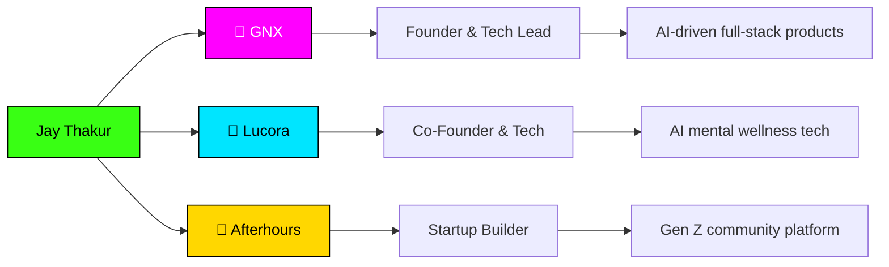

<div align="center">


<br/>


[](https://www.linkedin.com/in/jaythakur308/)
[](https://www.instagram.com/jay_.stfu/)

</div>


## 👨‍💻 WHOAMI

```yaml
> whoami --verbose

name:          Jay Thakur
location:      India 🇮🇳
role:          Founder & Tech Lead @ GNX | Co-Founder @ Lucora
education:     CSE @ Chandigarh University (Grad: 2027)
focus:         Software Engineering & Generative AI
obsessions:    [LLMs, RAG, Agentic AI, LangChain, Local LLMs]
status:        🟢 online — building something at this exact moment
philosophy:    "I don't just learn technology — I build with it."
```


## ⚡ TECH ARSENAL

<div align="center">

### 💻 Languages


### 🌐 Web & App


### 🤖 AI / GenAI


### 🗄️ Backend & DB


### 🛠 Tools


</div>


## 🚀 THINGS I'VE BUILT

<table>
<tr>
<td width="50%">

### 🧠 Lucora — AI Therapy Assistant
LLM-powered conversational system for AI-assisted mental wellness. Built as core tech at Lucora.

</td>
<td width="50%">

### 🏦 Agentic Banking System
Multi-agent architecture — specialized AI agents collaborating on tool-based decision workflows.

</td>
</tr>
<tr>
<td width="50%">

### 🗣️ Allen — AI Chat App
Cross-platform Flutter app running local LLMs via Ollama, with AI image generation baked in.

</td>
<td width="50%">

### 📚 RAG Applications
Document Q&A over PDFs & websites — embeddings, semantic retrieval, context-aware responses.

</td>
</tr>
<tr>
<td width="50%">

### 🎨 Air Canvas
Draw in thin air. Real-time hand tracking + computer vision turns gestures into strokes.

</td>
<td width="50%">

### 🎵 iPod Classic React
A pixel-perfect, fully interactive React recreation of the OG iPod Classic UI.

</td>
</tr>
</table>


## 🏗️ WHERE I BUILD




## 🌊 GITHUB STATS

<div align="center">


<br/>


<br/>


<br/>


</div>


## 📚 CURRENTLY GRINDING

<div align="center">


</div>


## 🐍 CONTRIBUTION SNAKE

<div align="center">


<sub>⚠️ Snake generates automatically once the <code>generate-snake.yml</code> Action is added to your repo — see setup note below.</sub>
</div>


## 💡 FUN FACTS

```javascript
const jay = {
  learns: "hands-on, system-level, no fluff",
  builds: ["AI agents", "RAG pipelines", "LLM apps", "real-world software"],
  currentObsession: "Agentic AI",
  favoriteBug: "the one that fixed itself",
  motto: () => "I don't just learn technology — I build with it."
};

console.log(jay.motto());
// > "I don't just learn technology — I build with it."
```

<div align="center">

### ⚡ ALWAYS LEARNING. ALWAYS BUILDING. ALWAYS SHIPPING. ⚡


**Made with 🔥 (and way too much caffeine) by Jay Thakur**

</div>
